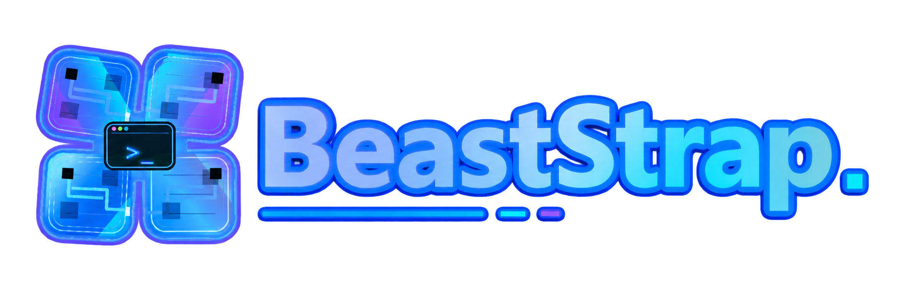

<!-- markdownlint-disable MD033 MD041 -->

> [!CAUTION]
> The only official place to download BeastStrap is **our repo on GitHub** — the [Releases page](https://github.com/revenantsupport-spec/BeastStrap/releases). Anywhere else offering "BeastStrap" is not us. Don't download from them.

<p align="center">
  
</p>

<p align="center">
  <a href="./LICENSE"></a>
  <a href="https://github.com/revenantsupport-spec/BeastStrap/releases/latest"></a>
  <a href="https://discord.robloxscripts.com"></a>
  <a href="https://github.com/revenantsupport-spec/BeastStrap"></a>
</p>

<p align="center">
  <a href="https://github.com/revenantsupport-spec/BeastStrap/releases/latest">
    
  </a>
</p>

**The Roblox launcher built for executor and exploit users.** A fork of [Bloxstrap](https://github.com/bloxstraplabs/bloxstrap) hardened against the things that break executors — surprise channel routing, updates that ship before your tool catches up, and ban traces left on your machine — plus a load of quality-of-life extras.

> [!NOTE]
> Windows 10 and above. Built for Roblox exploit / executor users — if you only play vanilla Roblox, you probably don't need most of what's here.

## Features

- **LIVE channel lock** — forces Roblox onto production every launch, fixing most "my executor broke after a Roblox update" cases.
- **Versions Manager** — one saved profile per executor with its own isolated install folder, one-click switching, and auto-updates from weao.xyz.
- **One-click downgrading** — pin any historical Roblox build (with CDN verification), or use "Match your executor" to auto-pick the right one.
- **BanAsync tools** — clean Roblox traces, spoof your network MAC, randomize MachineGuid, and wipe only your Roblox cookies (other sites untouched).
- **Multi-instance** — run several Roblox clients at once, auto-arranged into a tidy grid.
- **VIP server picker** — join a free shared VIP server before launch.
- **Fast Flag editor** — edit flags the safe way (config file, not process injection), with a banner spelling out what actually gets you banned.
- **Auto-update** — real progress bar, fires both on launch and when you open the menu.
- **Privacy by default** — tracking cookies wiped before every launch, analytics hardcoded off.
- **Clear error messages** — failures tell you the real reason (DNS, TLS, rate limit, disk full…), not "something went wrong".

## Install

1. Download the latest `BeastStrap-vX.Y.exe` from the [Releases page](https://github.com/revenantsupport-spec/BeastStrap/releases).
2. Run it. It's self-contained (no .NET install needed) and lands in `%localappdata%\BeastStrap`.

To uninstall: **Windows Settings → Apps**, search "BeastStrap" — or run `BeastStrap.exe -uninstall`.

## Unsigned build & antivirus

Releases ship **unsigned**, so Windows SmartScreen — and sometimes Defender, as `Wacatac.H!ml` — may warn on first run. **It's a false positive.** An unsigned single-file .NET app that legitimately touches the registry, spoofs your MAC, and cleans cookies is exactly what trips machine-learning heuristics. Code signing is on the way and will stop these for good.

Want to be sure your copy is genuine? Check its SHA-256 against the `SHA256SUMS` on the release, scan it on [VirusTotal](https://www.virustotal.com), or build it yourself.

<details>
<summary><b>Build it yourself · recover a quarantined file</b></summary>

```
git clone --recurse-submodules https://github.com/revenantsupport-spec/BeastStrap.git
cd BeastStrap
dotnet publish MrExStrap/BeastStrap.csproj -p:PublishSingleFile=true -r win-x64 -c Release --self-contained true
```

Output lands at `MrExStrap/bin/Release/net6.0-windows/win-x64/publish/BeastStrap.exe`.

If Defender already quarantined it: **Windows Security → Virus & threat protection → Protection history → Restore**, then add an exclusion for `%localappdata%\BeastStrap`. If the auto-updater's download keeps getting flagged, grab the new release manually from the [Releases page](https://github.com/revenantsupport-spec/BeastStrap/releases). Each release is submitted to Microsoft as a false positive, which usually clears within a few days.

</details>

## Which launcher?

| Pick this if you… | Use |
| --- | --- |
| Run executors/externals and want them to keep working | **BeastStrap** |
| Want a polished player launcher with broad theme support | Fishstrap |
| Want official vanilla Bloxstrap with the largest user base | Bloxstrap |

## Credits & support

Vibe pasted by **Sir Meme** — in the Roblox community since 2017, formerly Synapse Softworks LLC, now runs [robloxscripts.com](https://robloxscripts.com). Vibe coded with Claude.

Found a bug? [Open an issue](https://github.com/revenantsupport-spec/BeastStrap/issues) or ask in the [Discord](https://discord.robloxscripts.com).

## License

[MIT](./LICENSE), inherited from [vanilla Bloxstrap](https://github.com/bloxstraplabs/bloxstrap) by pizzaboxer et al. This fork's changes are © 2026 revenantsupport-spec.

<!-- sirmeme-watermark -->

---
<sub>⭐ <b>Official source:</b> <a href="https://github.com/revenantsupport-spec/BeastStrap">github.com/revenantsupport-spec/BeastStrap</a> &nbsp;·&nbsp; built &amp; maintained by <b>revenantsupport-spec</b>. Got this somewhere else? Grab the latest, verified version at the link above.</sub>
<!-- /sirmeme-watermark -->
